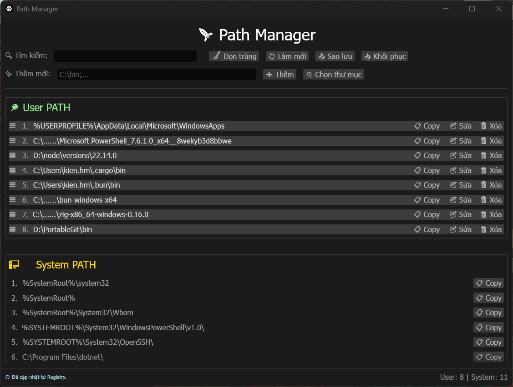
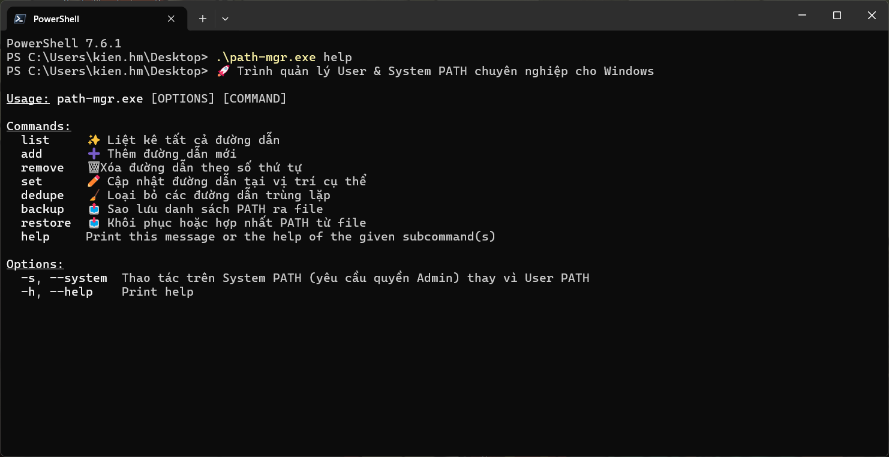

# 🚀 Path Manager (path-mgr)

Một công cụ chuyên nghiệp, mạnh mẽ để quản lý biến môi trường PATH trên Windows, hỗ trợ cả giao diện đồ họa (GUI) và dòng lệnh (CLI).



## ✨ Tính năng chính

### 🖥️ Giao diện đồ họa (GUI)
- **Quản lý trực quan:** Tách biệt rõ ràng giữa User PATH và System PATH.
- **Chẩn đoán thông minh:** 
    - Tự động phát hiện các thư mục không tồn tại (hiện màu đỏ ⚠️).
    - Cảnh báo các thư mục không chứa file thực thi (.exe, .bat, ...) giúp dọn dẹp PATH hiệu quả.
- **Kéo & Thả (Drag & Drop):** Thay đổi thứ tự ưu tiên của các đường dẫn chỉ bằng cách kéo handle `☰`.
- **Tìm kiếm nhanh:** Lọc danh sách đường dẫn theo thời gian thực.
- **Sao lưu & Khôi phục:** Xuất danh sách PATH ra file .txt và hợp nhất lại bất cứ lúc nào.
- **Dọn trùng thông minh:** Tự động xóa các đường dẫn trùng lặp hoặc các đường dẫn User đã có sẵn trong System.
- **Theo dõi Registry:** Tự động làm mới giao diện khi có thay đổi từ hệ thống hoặc các ứng dụng khác.

### ⌨️ Dòng lệnh (CLI)

- **Liệt kê:** Xem danh sách PATH đánh số thứ tự.
- **Thêm/Xóa:** Thêm mới hoặc xóa đường dẫn theo chỉ mục.
- **Dọn dẹp:** Chạy tính năng dọn trùng nhanh chóng.
- **Tự động hóa:** Hỗ trợ backup/restore qua script.

## 🛠️ Cài đặt & Chạy

### Yêu cầu
- Windows 10/11.
- [Rust](https://rustup.rs/) (nếu bạn tự build từ nguồn).

### Build từ source

#### Cách 1: Build trực tiếp trên Windows
```bash
cargo build --release
```
File thực thi sẽ nằm tại `target/release/path-mgr.exe`.

#### Cách 2: Cross-compile từ Linux/WSL (Sử dụng Zig)
Cách này giúp tạo ra file `.exe` cực nhẹ và tối ưu mà không cần cài đặt Visual Studio Build Tools nặng nề.

1. **Cài đặt công cụ:**
   - Cài [Zig](https://ziglang.org/download/)
   - Cài `cargo-zigbuild`: `cargo install cargo-zigbuild`
   - Thêm target: `rustup target add x86_64-pc-windows-gnu`

2. **Build:**
   ```bash
   cargo zigbuild --target x86_64-pc-windows-gnu --release
   ```
File thực thi sẽ nằm tại `target/x86_64-pc-windows-gnu/release/path-mgr.exe`.

### Chạy ứng dụng
- **Mở GUI:** Chỉ cần click đúp vào file `.exe` hoặc chạy `path-mgr` không tham số.
- **Mở CLI:** Sử dụng các lệnh sau trong Terminal/PowerShell:
  ```bash
  path-mgr list            # Liệt kê tất cả PATH
  path-mgr add "C:\bin"    # Thêm đường dẫn mới
  path-mgr remove 1        # Xóa đường dẫn số 1
  path-mgr dedupe          # Dọn dẹp trùng lặp
  path-mgr backup b.txt    # Sao lưu ra file
  path-mgr restore b.txt   # Khôi phục từ file
  ```

## 🛡️ An toàn & Bảo mật
- **Bảo vệ System PATH:** Trong giao diện GUI, System PATH được đặt ở chế độ chỉ đọc để tránh các thao tác nhầm lẫn gây hỏng hệ thống.
- **Giải mã biến môi trường:** Hỗ trợ hiển thị và xử lý các đường dẫn chứa `%USERPROFILE%`, `%SystemRoot%`, ... một cách chính xác.

## 🎨 Công nghệ sử dụng
- **Ngôn ngữ:** Rust (An toàn và Hiệu năng cực cao).
- **GUI Framework:** `egui` & `eframe` (Mượt mà, giao diện tối hiện đại).
- **Registry:** `winreg` & `windows-sys`.

---
*Phát triển bởi uongsuadaubung*
